# MedEasy UI-Spezifikation & Funktionsbeschreibung

**Version:** 1.0  
**Datum:** 25.06.2025  
**Status:** Finalisiert für MVP-Entwicklung

---

## 🎯 Übersicht

Dieses Dokument spezifiziert die komplette Benutzeroberfläche und Funktionalität der MedEasy MVP-Version. Es dient als verbindliche Grundlage für die Entwicklung und definiert alle UI-Komponenten, Workflows und Interaktionen.

---

## 🏗️ UI-Architektur

### **Layout-Struktur**
```
┌─────────────────────────────────────────────────────────┐
│                    Header (Status Bar)                   │
├─────────────┬───────────────────────────────────────────┤
│             │                                           │
│   Sidebar   │         Hauptbereich                     │
│   (280px)   │    (Transcript/Summary/Split)            │
│             │                                           │
│             ├───────────────────────────────────────────┤
│             │     Analyse & Export (Collapsible)       │
└─────────────┴───────────────────────────────────────────┘
```

---

## 📦 Komponenten-Spezifikation

### **1. Header-Bereich**

#### 1.1 Logo & Session-Info
```typescript
interface HeaderInfo {
  logo: "🏥 MedEasy"
  patient: string // Anonymisiert: "****" 
  sessionId: string // Format: "#4711"
}
```

#### 1.2 Session-Status-Indikator
```typescript
interface SessionStatus {
  recording: {
    active: boolean
    duration: string // "MM:SS"
    visualIndicator: "🔴" | "⏸️" | "✅"
  }
  connection: {
    online: boolean
    indicator: "🟢 Online" | "🔴 Offline-Modus"
  }
}
```

#### 1.3 Notfall-Funktionen
```html
<div class="emergency-controls">
  <button title="Notfall-Speicherung">💾</button>
  <button title="Bildschirm schwärzen">👁️</button>
</div>
```

---

### **2. Linke Sidebar**

#### 2.1 Session-Management
```typescript
interface SessionManagement {
  newSessionButton: {
    text: "➕ Neue Sitzung"
    action: () => showConsentDialog()
  }
  
  navigationTabs: {
    tabs: ["Letzte Sitzungen", "Alle Patienten"]
    defaultActive: "Letzte Sitzungen"
  }
  
  patientList: {
    searchable: true
    sortBy: "lastVisit" | "name" | "sessionCount"
    displayFields: ["name", "lastVisit", "sessionCount"]
  }
}
```

#### 2.2 Audio-Control
```typescript
interface AudioControl {
  recordButton: {
    states: ["START", "STOP", "PAUSE"]
    size: "100px"
    shortcut: "Space"
  }
  
  audioQuality: {
    signalStrength: number // -20 to 0 dB
    visualMeter: boolean
    collapsible: true
  }
}
```

#### 2.3 Performance Monitor
```typescript
interface PerformanceMonitor {
  metrics: {
    cpu: { current: number, warning: 70, critical: 85 }
    ram: { current: number, warning: 70, critical: 85 }
    latency: { current: number, warning: 1000, critical: 2000 }
  }
  defaultState: "collapsed"
}
```

---

### **3. Hauptbereich**

#### 3.1 Content-Tabs
```typescript
interface ContentTabs {
  tabs: [
    { id: "transcript", label: "Transkript", icon: "📝" },
    { id: "summary", label: "Zusammenfassung", icon: "📊" }
  ]
  activeTab: "transcript"
}
```

#### 3.2 Transkript-Bereich
```typescript
interface TranscriptArea {
  header: {
    title: "Live-Transkript"
    anonymizationStatus: {
      erkannt: number
      geprueft: number
      unsicher: number
      reviewButton: boolean // Zeigt bei unsicher > 0
    }
    lowConfidenceWarning: {
      show: boolean // wenn confidence < 60%
      text: "⚠️ Niedrige Transkriptions-Genauigkeit"
    }
    actions: ["search", "settings"]
  }
  
  entries: {
    speaker: "doctor" | "patient" | "relative" | "mpa"
    text: string
    timestamp: string
    editable: true
    anonymizedTerms: Array<{
      text: string
      confidence: number
      type: "name" | "date" | "location" | "id"
    }>
  }
}
```

#### 3.3 Split-View (für Dokumente)
```typescript
interface SplitView {
  left: {
    content: "transcript_readonly"
    width: "50%"
  }
  right: {
    content: "document_editor"
    width: "50%"
    toolbar: ["save", "print", "pdf", "close"]
  }
}
```

---

### **4. Analyse & Export Panel**

#### 4.1 Panel-Struktur
```typescript
interface AnalysisPanel {
  collapsible: true
  defaultState: "expanded"
  height: "300px"
  
  tabs: [
    { id: "symptoms", label: "Symptome" },
    { id: "diagnosis", label: "Diagnose" },
    { id: "export", label: "Export" }
  ]
}
```

#### 4.2 Symptome-Tab
```typescript
interface SymptomsTab {
  processingStatus: {
    provider: "OpenAI GPT-4" | "Lokal"
    state: "processing" | "completed"
    duration: number // Sekunden
  }
  
  symptoms: Array<{
    name: string
    icdCode: string
    confidence: number // 0-100
    confidenceLevel: "high" | "medium" | "low"
  }>
}
```

#### 4.3 Export-Tab
```typescript
interface ExportTab {
  options: [
    {
      id: "epat"
      name: "E-PAT Export"
      action: "split-view"
      format: "structured-text"
    },
    {
      id: "arztbrief"
      name: "PDF Arztbrief"
      action: "split-view"
      format: "pdf"
    },
    {
      id: "fhir"
      name: "FHIR JSON"
      action: "download"
      format: "json"
    }
  ]
  
  exportHistory: Array<{
    type: string
    timestamp: string
    status: "success" | "failed"
  }>
}
```

---

## 🔄 Workflows & Interaktionen

### **1. Session-Start Workflow**

```mermaid
graph LR
    A[Neue Sitzung] --> B{Einwilligung}
    B -->|OK| C[Patient wählen]
    C --> D[Session initialisieren]
    D --> E[Aufnahme bereit]
    B -->|Abbruch| F[Zurück]
```



#### Einwilligungs-Dialog
```typescript
interface ConsentDialog {
  title: "Einwilligung bestätigen"
  checkboxes: [
    {
      id: "recording"
      label: "✓ Patient wurde über Aufnahme informiert"
      required: true
    },
    {
      id: "cloudProcessing"
      label: "✓ Anonymisierte Cloud-Verarbeitung erlaubt"
      required: false
    }
  ]
  buttons: ["Abbrechen", "Session starten"]
}
```

### **2. Aufnahme & Live-Transkription**

#### Start/Stop-Logik
```typescript
function toggleRecording() {
  if (!currentSession.consentGiven) {
    showConsentDialog()
    return
  }
  
  if (isRecording) {
    stopRecording()
    finalizeTranscript()
  } else {
    startRecording()
    initializeLiveTranscription()
  }
}
```

#### Live-Transkription Updates
```typescript
interface TranscriptionUpdate {
  speaker: string
  text: string
  timestamp: Date
  confidence: number
  anonymizedVersion: string
}

// Update alle 2-3 Sekunden
// Smooth scroll zum neuesten Eintrag
// Fade-in Animation für neue Einträge
```

### **3. Anonymisierungs-Review**

```typescript
interface AnonymizationReview {
  trigger: "manual" | "auto" // Auto bei >3 unsicher
  
  reviewItems: Array<{
    originalText: string
    highlightedTerm: string
    confidence: number
    suggestedType: "name" | "location" | "medication"
    actions: ["Als X belassen", "Anonymisieren"]
  }>
}
```

### **4. Dokument-Bearbeitung (Split-View)**

#### Workflow
1. Klick auf "Bearbeiten" im Export-Tab
2. Split-View öffnet sich
3. Links: Read-only Transkript
4. Rechts: Editierbares Dokument
5. Toolbar-Aktionen verfügbar
6. Speichern/Exportieren
7. Split-View schließen

---

## ⚙️ Einstellungen

### **Audio & Performance**
```yaml
mikrofon:
  type: dropdown
  options: [system_default, usb_devices, bluetooth]
  
whisper_model:
  type: dropdown
  options:
    - { value: "auto", label: "🤖 Automatische Auswahl" }
    - { value: "tiny", label: "Tiny (~1GB)" }
    - { value: "base", label: "Base (~1.5GB)" }
    - { value: "small", label: "Small (~2.5GB)" }
    - { value: "medium", label: "Medium (~5GB)" }
    
gpu_acceleration:
  type: toggle
  default: false
  requirement: "CUDA-compatible GPU"
  
session_length:
  type: dropdown
  options: [30, 60, 90, "unlimited"]
  default: 60
```

### **Datenschutz & Sicherheit**
```yaml
auto_anonymization:
  type: toggle
  enabled: true
  locked: true # Kann nicht deaktiviert werden
  
strict_mode:
  type: toggle
  default: true
  description: "Mehr False-Positives, aber sicherer"
  
audit_logging:
  type: toggle
  default: true
  
cloud_processing:
  type: toggle
  default: false
  sub_options:
    - diagnosis_support
    - document_optimization
    - translation_services
```

---

## 🎨 Design-Spezifikationen

### **Farbschema**
```css
:root {
  --primary: #3B82F6;      /* Blau - Hauptaktionen */
  --success: #10B981;      /* Grün - Erfolg/Bereit */
  --warning: #F59E0B;      /* Orange - Warnung */
  --danger: #EF4444;       /* Rot - Fehler/Stop */
  --neutral: #6B7280;      /* Grau - Inaktiv */
  
  --bg-primary: #FFFFFF;   /* Haupthintergrund */
  --bg-secondary: #F9FAFB; /* Sekundärer Hintergrund */
  --border: #E5E7EB;       /* Rahmenfarbe */
}
```

### **Responsive Breakpoints**
```css
/* Desktop First - MVP nur Desktop */
@media (min-width: 1024px) { /* Standard */ }
@media (max-width: 1024px) { /* Tablet - Post-MVP */ }
@media (max-width: 768px) { /* Mobile - Post-MVP */ }
```

---

## ⌨️ Tastenkürzel

| Aktion | Shortcut | Kontext |
|--------|----------|---------|
| Start/Stop Aufnahme | `Leertaste` | Global |
| Speichern | `Ctrl+S` | Dokument-Editor |
| Suchen | `Ctrl+F` | Transkript |
| Einstellungen | `Ctrl+,` | Global |
| Notfall-Speicherung | `Ctrl+Shift+S` | Global |
| Vollbild | `F11` | Global |

---

## 🔒 Sicherheits-Features

### **Automatische Sicherungen**
- Alle 5 Minuten während Aufnahme
- Bei Session-Ende
- Vor kritischen Operationen

### **Datenschutz-Indikatoren**
- 🔒 Verschlüsselt gespeichert
- ☁️ Cloud-Verarbeitung aktiv
- 🔐 Lokal verarbeitet
- ⚠️ Unsichere Anonymisierung

### **Session-Timeout**
- Nach 30 Minuten Inaktivität
- Warnung nach 25 Minuten
- Automatische Speicherung vor Logout

---

## 📝 Implementierungs-Prioritäten

### **Phase 1: Kern-UI (Woche 1-2)**
1. Layout-Struktur
2. Audio-Aufnahme UI
3. Live-Transkript-Anzeige
4. Basis-Navigation

### **Phase 2: Erweiterte Features (Woche 3-4)**
1. Einwilligungs-Management
2. Anonymisierungs-Review
3. Analyse-Panel
4. Export-Grundfunktionen

### **Phase 3: Optimierung (Woche 5-6)**
1. Split-View für Dokumente
2. Erweiterte Einstellungen
3. Performance-Optimierung
4. Keyboard-Shortcuts

### **Phase 4: Polish (Woche 7-8)**
1. Animationen & Transitions
2. Error-Handling UI
3. Tooltips & Hilfe
4. Final Testing

---

## 🚨 Kritische UI-Anforderungen

1. **Anonymisierung IMMER sichtbar** und nicht deaktivierbar
2. **Cloud-Verarbeitung** nur mit expliziter Zustimmung
3. **Diagnose-Warnungen** prominent anzeigen
4. **Notfall-Funktionen** immer erreichbar
5. **Session-Status** immer sichtbar